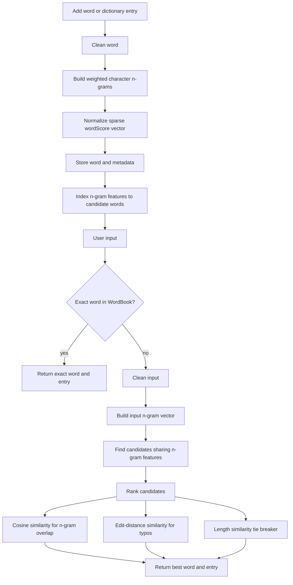

# Custom-Spellcheck
Takes a list of words specified by user and spellchecks input text to that dictionary.

The current scorer is CPU-only and dependency-free. Each word is represented as a
sparse character n-gram vector, candidates are compared with cosine similarity,
and close matches are ranked with an edit-distance tie breaker.

Flow Chart of WordBook Initialization & Word Selection



<h3>Example (color_example.py):</h3>

```
import json

import custom_spellcheck as sc

with open('colors.json', encoding="utf-8") as json_file:
    colors = json.load(json_file)

color_book = sc.WordBook()
color_book.add_dictionary_to_WordBook(colors)

rgb = color_book.spellcheck_word("ponk")

print(rgb[0])

print(rgb[1])

print(color_book.spellcheck_word("ponk")[1]["RGB"])
```

<h3>Unchecked Input</h3>
INPUT (without Custom Spellcheck): `rgb = color_book["ponk"]["RGB"]`

OUTPUT: `Key Error`

<h3>Spellchecked Input</h3>
INPUT (with Custom Spellcheck): `rgb = color_book.spellcheck_word("ponk")[1]["RGB"]`

OUTPUT: `rgb = color_book["pink"]["RGB"]`

Note: `color_book.spellcheck_word("ponk")[1]` gets the information of the word (RGB in this case),
`color_book.spellcheck_word("ponk")[0]` is the word
